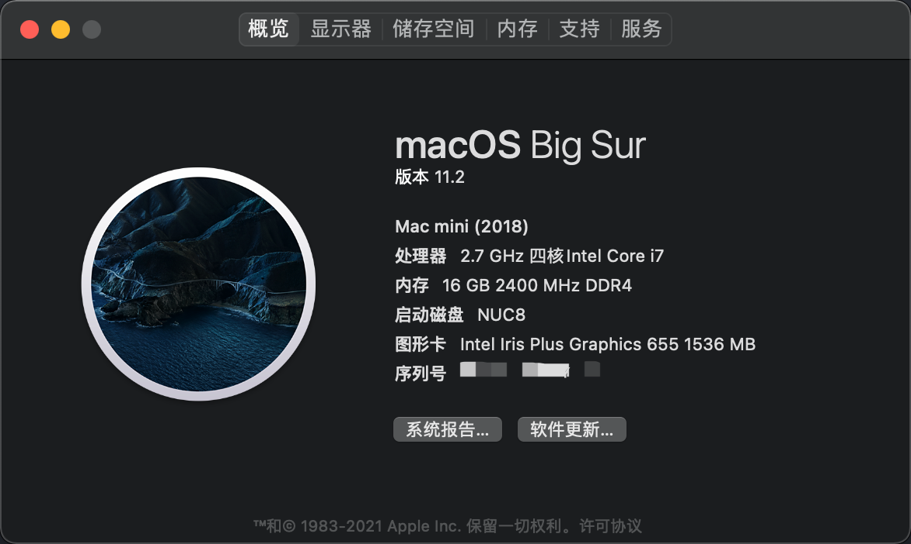

#### NUC8I7BEH Hackintosh with OpenCore 0.6.6 UEFI
##### Mac Big Sur 11.2 (20D64)

### Supported macOS versions
+ macOS Mojave 10.14.6
+ macOS Catalina 10.15.7
+ macOS Big Sur 11.x

### BIOS Setting
##### BIOS version: [0087](https://downloadcenter.intel.com/zh-cn/download/30154/BIOS-BECFL357-)
+ Disable
    - Legacy Boot
    - Fast Boot
    - Network Boot
    - Secure Boot
    - Inter VT for directed I/VO(VT-d)
+ Enable
    - Boot USB Devices First
    - Boot Network Devices Last
+ Wake on LAN from S4/S5
    - Stay Off
+ Devices Settings
    - Video IGD Minimum Memory <64 MB>
    - Video IGD Aperture Size <256 MB>
    - Video IGD Primary Video Port <HDMI or Thunderbolt, you choose>
    - Video IGD Secondary Video Port <None>
    - Onboard Devices WLAN <Disable>
    - Onboard Devices Bluetooth <Disable>

### Not works
+ you tell me

### How to install
+ Create bootable USB with macOS Catalina (Windows or Mac)
+ Copy OC/0.5.9/EFI to your BOOT folder
+ Change your mac serial number in OC/config.plist

### Spec
+ WLAN+Bluetooth
    - Apple BCM943602CS
    - BCM943602CS PCIe M.2 NGFF
    - WIFI Antenna
+ Memory
    - ADATA 8GB DDR4 2666 x2
+ SSD
    - SAMSUNG 860 EVO 250GB (MZ-76E250B)
+ Monitor1
    - Dell U2720Q (Thunderbolt3 to DP)
+ Monitor2
    - Dell P2414H (Native HDMI)